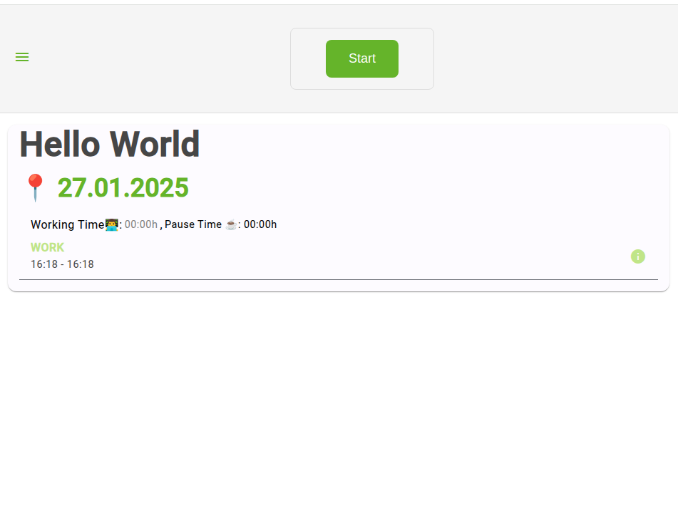
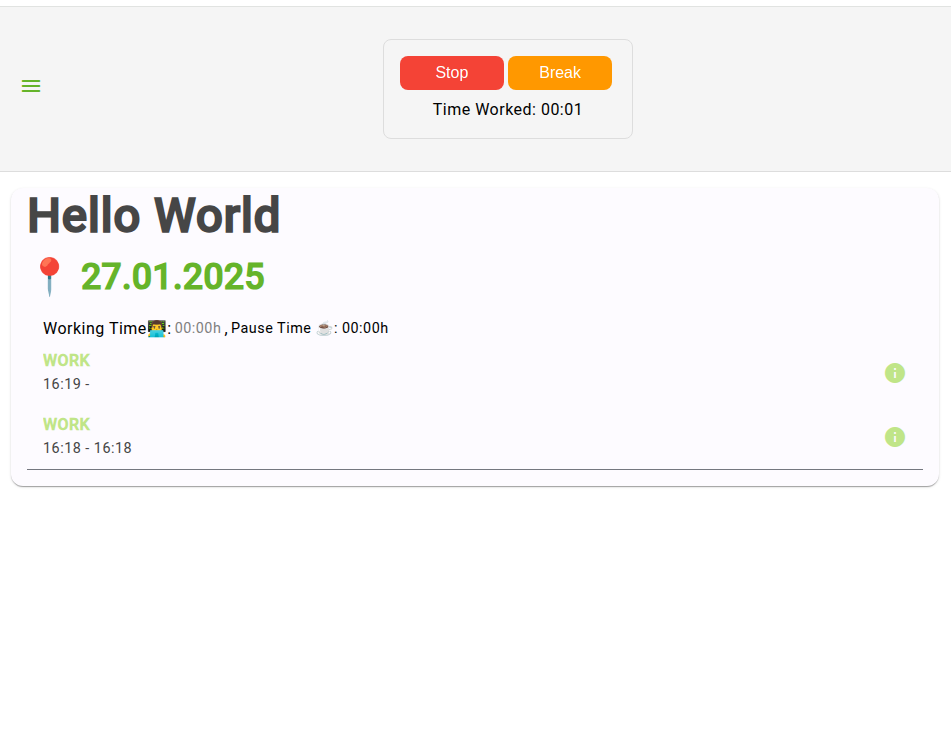
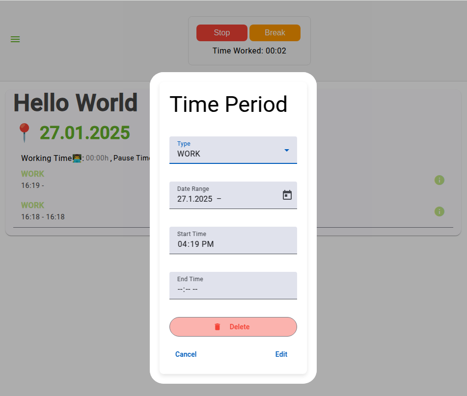
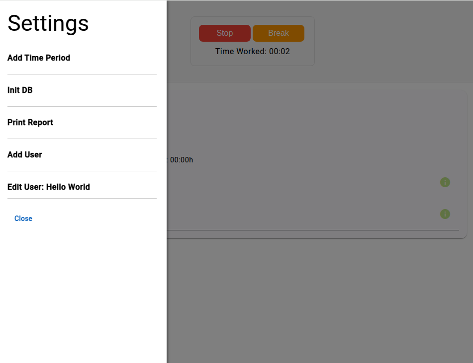
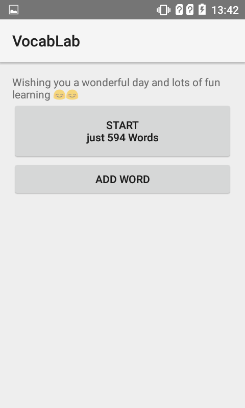
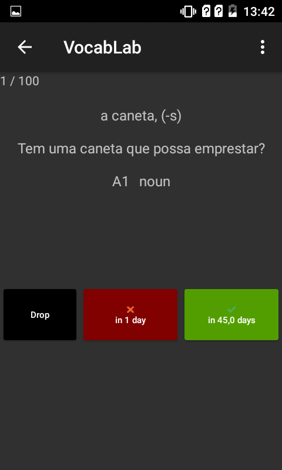
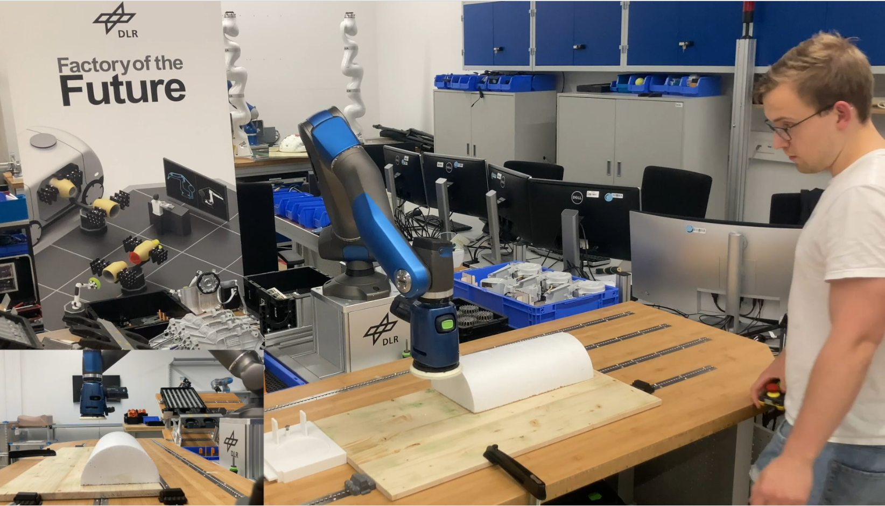

# My Projects
A list of my passion programming projects.

## Content Overview

1. [Java - Tetris](#java---tetris-2019)
2. [Microcontroller - Arduino](#microcontroller---arduino-2019)
3. [C - Operating System on a Mircocontroller](#c---operating-system-on-microcontroller-2020)
4. [Swift Mac - Subtitle Adder](#swift-mac---subtitle-adder-2020)
5. [SwiftUI iOS - Calendar App](#swiftui-ios---calendar-app-2021)
6. [Python - Video to note sheet 1.0](#python---video-to-note-sheet-10-2021)
7. [Hardware - Reparing my Mac Book Screen](#hardware---reparing-my-mac-book-screen-2022)
8. [C++ - Bachelor Thesis](C++-Parallel-Computing---Bachelor-Thesis-2022)
9. [Swift iOS - Piano Songs Learning App](#swift-ios---piano-songs-learning-app-2022)
10. [Python - Video to note sheet 2.0](#python---video-to-note-sheet-20-2021)
11. [C - IoT](C-Microcontroller---IoT-2023)
12. [Web development - Internship at Medigital](#web-development---internship-at-medigital-2023)
13. [Robots, CAD & Python - Master Thesis](#robots--cad--python---master-thesis-2024)
14. [Java Script iOS - Workout Tracker](#java-script-ios---workout-tracker-2023---2024)
15. [Bash/Apple Scripts - Scripts](#bashapple-scripts---scripts)
16. [Machine Learning](#machine-learning)
17. [Android App](#Android-App---VocabLab-2024)
18. [Working Time Tracker](#Angular-Springboot-Web-Dev---Working-time-tracker-2024)
19. [MQTT Analysis](#Python-Docker---MQTT-broker-analysis-2024)

### Machine Learning 
Currently working on...

### Python Docker - MQTT broker analysis (2024)

I analyzed 6 MQTT broker reading to reliability. I tested under which circumstances message lost accrued. I worked with RabbitMQ, BiFroMQ, EMQX, HiveMQ, Mosquitto, VerneMQ.

### Angular Springboot Web Dev - Working time tracker (2024)

Web application to track working times 951×737, 

 
    
    

    
    

### Android App - VocabLab (2024)

It was not possible to edit or add words to my Portuguese vocabulary iPhone app. So, I extracted the Database, converted it, and constructed an android app to continue learning with my progress I archived.

    
    

### Java Script iOS - Workout Tracker (2023 - 2024)
Recommended to take a look:  
I wanted to create a simple workout tracker (click [here](https://github.com/larsleimbach/TrackRep) to see more). I used the App 
[Scritable](https://scriptable.app/) to create it because I don't pay 100$ a year to publish an iPhone app.

Version 0.1 was realized with Apple Shortcuts app. Apple's Shortcut app is not suitable for this task...

Version 0.5 was using the Scritable app

The current version 0.9 implements a more appealing UX and new features

  
### Robots CAD & Python - Master Thesis (2024)
Next to the visualization and analysis in Python, I worked with CAD and Robots.

     

    

### Web development Full Stack - Internship at Auta Health (2023)
I worked with Django and React during my internship at a start-up company called Auta Health. We implemented the red marked feature of the Web app:

    

### C Microcontroller - IoT (2023) 

In university we created a microcontroller that counts in coming and out going persons into a room. We used a state machine to realize it. MQTT was used for communication with the ESP 32. 

### Python - Video to note sheet 2.0 (2022)
I created a second version in Python on my iPad during a two-week vacation to increase the performance of version 1.0.

    

### C++ Parallel Computing - Bachelor Thesis (2022)

I extended a C++ analyze program by additional analyze pattern.

### Swift iOS - Piano Songs Learning App (2022)
This app offers a control interface for piano songs, like setting markers, reducing fine graded playback speed, and more.

### Hardware - Reparing my Mac Book Screen (2022)
My backlight died due to a too short backlight cable of the MacBook Pro 2016. I fixed the backlight cable but sadly I broke the LCD while repairing.

    

Short success...

Final result

    

### Python - Video to note sheet 1.0 (2021)
A program that transforms a piano learning video to a note sheet.

### SwiftUI iOS - Calendar App (2021)
We created a Calendar app in SwiftUI during a university programming project.

### Swift Mac - Subtitle Adder (2020)
If you have a subtitle to a video but the subtitle is drifting over time. I created a "semi-professional" GUI to set the correct subtitle.

    

### C - Operating System on Microcontroller (2020) 
We implemented a simple operating system in C on a microcontroller during a university programming project.

### Microcontroller - Arduino (2019) 
Realizing a table decoration with Arduino.

    
    
    
    

Here a demonstration video:

### Java - Tetris (2019)
Starting with my Bachelor in Computer Science I decided to create my own Tetris in Java.

## Bash/Apple Scripts - Scripts
I am using various scripts and shortcuts for my Mac and Linux. For example, when my MacBook screen failed, I had a script that selected my iPad as a screen after turning on the MacBook.
