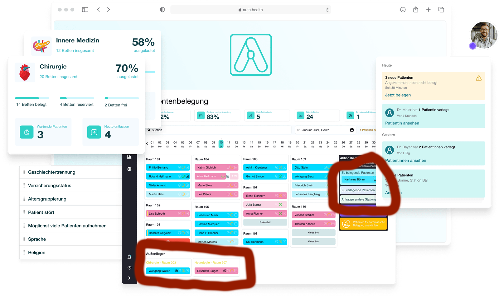
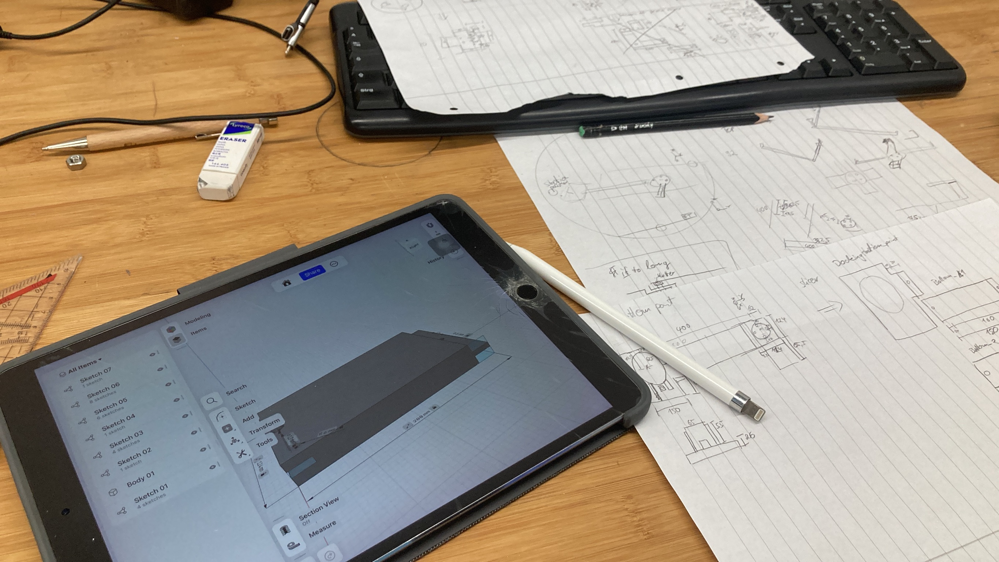

# My Projects
A list of my passion programming projects.

## Content Overview

1. [Java - Tetris](#java---tetris-2019)
2. [Microcontroller - Arduino](#microcontroller---arduino-2019)
3. [C - Operating System on a Mircocontroller](#c---operating-system-on-microcontroller-2020)
4. [Swift Mac - Subtitle Adder](#swift-mac---subtitle-adder-2020)
5. [SwiftUI iOS - Calendar App](#swiftui-ios---calendar-app-2021)
6. [Python - Video to note sheet 1.0](#python---video-to-note-sheet-10-2021)
7. [Hardware - Reparing my Mac Book Screen](#hardware---reparing-my-mac-book-screen-2022)
8. [Swift iOS - Piano Songs Learning App](#swift-ios---piano-songs-learning-app-2022)
9. [Python - Video to note sheet 2.0](#python---video-to-note-sheet-20-2021)
10. [Web development - Internship at Medigital](#web-development---internship-at-medigital-2023)
11. [CAD & Python - Master Thesis](#cad--python---master-thesis-2024)
12. [Java Script iOS - Workout Tracker](#java-script-ios---workout-tracker-2023---2024)
13. [Bash/Apple Scripts - Scripts](#bashapple-scripts---scripts)
14. [Machine Learning](#machine-learning)

### Java - Tetris (2019)
Starting with my Bachelor in Computer Science I decided to create my own Tetris in Java.

### Microcontroller - Arduino (2019) 
Realizing a table decoration with Arduino.

    
    
    
    

Here a demonstration video:

### C - Operating System on Microcontroller (2020) 
We implemented a simple operating system in C on a microcontroller during an university programming project.

### Swift Mac - Subtitle Adder (2020)
If you have a subtitle to a video but the subtitle is drifting over time. I created a "semi-professional" GUI to set the correct subtitle.

    

### SwiftUI iOS - Calendar App (2021)
We created a Calendar app in SwiftUI during an university programming project.

### Python - Video to note sheet 1.0 (2021)
A program that transforms a piano learning video to a note sheet.

<video height="200" controls>
  <source src="videos/sheets from video.mp4" type="video/mp4">
</video>

### Hardware - Reparing my Mac Book Screen (2022)
My backlight died due to a too short backlight cable of the Mac Books Pro 2016. I fixed the backlight cable but sadly I broke the LCD while repairing.

    

Short success...

<video height="300" controls>
  <source src="videos/repair screen mac.mov" type="video/mp4">
</video>

Final result

    

### Swift iOS - Piano Songs Learning App (2022)
This app offers a control interface for piano songs, like setting markers, reducing fine graded the play back speed, and more.

<video height="300" controls>
  <source src="videos/bpm setter app.mov" type="video/mp4">
</video>

### Python - Video to note sheet 2.0 (2021)
I created a second version in Python on my iPad during a two-week vacation to increase the performance of version 1.0.

    

### Web development - Internship at Auta Health (2023)
I worked with Django and React during my internship at a start-up company called Auta Health. We implemented the red marked feature of the Web app:

    

### CAD & Python - Master Thesis (2024)
Next to the visualization and analysis in Python worked with CAD.

    

### Java Script iOS - Workout Tracker (2023 - 2024)
I wanted to create a simple workout tracker. I used the App 
[Scritable](https://scriptable.app/) to create it because I don't pay 100$ a year to publish an iPhone app.

Version 0.1 was realized with Apple Shortcuts app. Apple's Shortcut app is not suitable for this tasks...

<video height="400" controls>
  <source src="videos/TrackWeb 0.1.mov" type="video/mp4">
</video>

Version 0.5 was using the Scritable app

<video height="400" controls>
  <source src="videos/track rep 0.5.mov" type="video/mp4">
</video>

The current version 0.9 implements a more appealing UX and new features

<video src="videos/Track rep 0.9.mov" height="400" controls>
  

### Machine Learning 
Currently working on...

## Bash/Apple Scripts - Scripts
I am using varies scripts and shortcuts for my Mac and Linux. For example, when my Mac Book screen failed, I had a script that selected my iPad as a screen after turning on the Mac Book.
